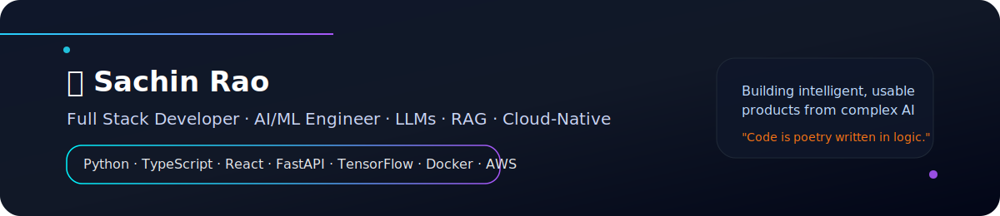

---

<h3>📄 CONNECT WITH ME</h3>

---

### ⚡ About Me

I am **Sachin Rao**, a passionate developer bridging the gap between **Full-Stack Engineering** and **Artificial Intelligence**. I specialize in building scalable web applications and fine-tuning LLMs for real-world utility.

- 🔭 I'm currently working on **CareerFlow AI & Resume Analyzer**
- 🌱 I'm currently learning **Advanced RAG Systems & Distributed Cloud Architecture**
- 👯 I'm looking to collaborate on **Open Source AI/ML Projects**
- 💬 Ask me about **React, Node.js, Python, or Machine Learning**
- ⚙️ **Tech Stack**: Python, JavaScript, TypeScript, C++, React, Node.js, FastAPI, TensorFlow, PyTorch

---

### 🛠️ Technical Arsenal

<a href="https://skillicons.dev">

  

  

  

</a>

---

### 🚀 Skills Visualization

 

 

---

### 📊 Github Analytics

<table>
<tr>
<td width="50%">

</td>
<td width="50%">

</td>
</tr>
</table>

---

### 🚀 Featured Projects

| Project | Description | Tech Stack | Status |
| :--- | :--- | :--- | :--- |
| **🎓 CareerFlow** | AI-Powered Career Guidance Platform with NLP job matching and resume optimization. | `Python` `TensorFlow` `React` `FastAPI` | 🚀 In Development |
| **📄 Resume Analyzer** | Intelligent ATS scoring system and skill extractor for resume optimization. | `NLTK` `FastAPI` `MongoDB` `React` | ✅ Deployed |
| **🗞️ News Scraper** | Automated pipeline scraping web news to Hugging Face datasets for analysis. | `Python` `BeautifulSoup` `HF API` `PostgreSQL` | ✅ Completed |
| **🩺 Saathi** | Mental health awareness web application with community support features. | `React` `Node.js` `Firebase` `Tailwind` | 🎯 Ongoing |

---

### 💡 Key Expertise Areas

- **Machine Learning**: Classification, Clustering (KMeans, SVM), NLP, LLM Fine-tuning, RAG Systems
- **Full-Stack Development**: MERN Stack, FastAPI, Microservices, Real-time Applications
- **Data Science**: EDA, Feature Engineering, Data Visualization, Statistical Analysis
- **Cloud & DevOps**: AWS, Docker, Kubernetes, GitHub Actions, CI/CD Pipelines
- **AI/LLMs**: Prompt Engineering, Model Training, LangChain, Hugging Face Integration

---

### 🎓 Learning & Growth

- Advanced RAG (Retrieval Augmented Generation) Systems
- Distributed Systems Architecture
- LLM Fine-tuning and Optimization
- Advanced Data Structures & Algorithms
- Cloud Architecture & Microservices

---

### 🏆 Achievements

- 📊 **2,600+** Total GitHub Contributions
- 🔥 **48** Day Contribution Streak
- 💻 **48** Repositories Created
- 🌟 Active contributor to Open Source projects
- 🎯 Built and deployed multiple AI/ML applications

---

### 🐍 Contribution Graph

---

 
<i>Let's connect and build the future together! 🚀</i>
 
<strong>Happy Coding!</strong> ✨

