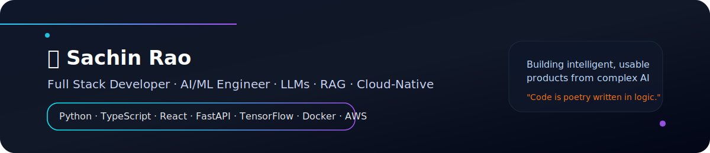
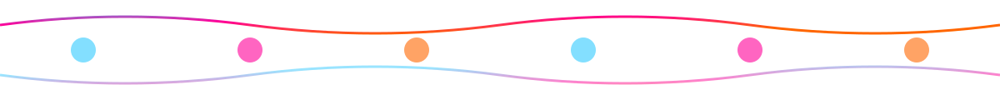
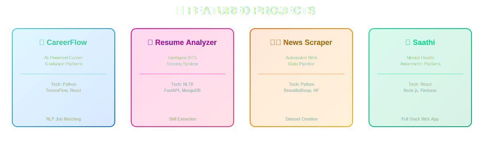

  

<h1 align="center">Sachin Rao</h1>

  Full Stack Developer • AI/ML Engineer • Building production-ready intelligent products

  <a href="https://www.linkedin.com/in/sachin6/">LinkedIn</a> •
  <a href="mailto:sachinraosahab7@gmail.com">Email</a> •
  <a href="https://github.com/Sachin23991">GitHub</a>

  
  

---

## About Me

I build software at the intersection of full stack development, machine learning, and LLM-powered systems.

- Building AI products with strong backend architecture and clean frontend UX
- Interested in RAG systems, resume intelligence, NLP workflows, and cloud deployment
- Strong with Python, TypeScript, React, FastAPI, TensorFlow, PyTorch, Docker, and AWS
- Open to meaningful collaborations in AI, ML, and developer tooling

  

## Tech Stack

### Languages

### Frameworks & Platforms

### AI / ML

  

---

## Featured Projects

  

### CareerFlow AI
AI-powered career guidance platform with job matching, resume optimization, and career path insights.

### Resume Analyzer
ATS-focused resume analysis system that extracts skills, scores resumes, and gives actionable suggestions.

### News Scraper Pipeline
Automated data pipeline for scraping, cleaning, and publishing datasets for NLP workflows.

### Saathi
Community-first mental health platform designed for peer support and safe conversations.

---

## GitHub Stats

  
  

  

  

---

## Currently Learning

  

- Advanced RAG systems
- Distributed cloud architecture
- LLM fine-tuning
- DSA and scalable backend systems

---

## Connect

  <a href="https://www.linkedin.com/in/sachin6/">LinkedIn</a> •
  <a href="mailto:sachinraosahab7@gmail.com">Email</a> •
  <a href="https://github.com/Sachin23991">GitHub</a>

  

